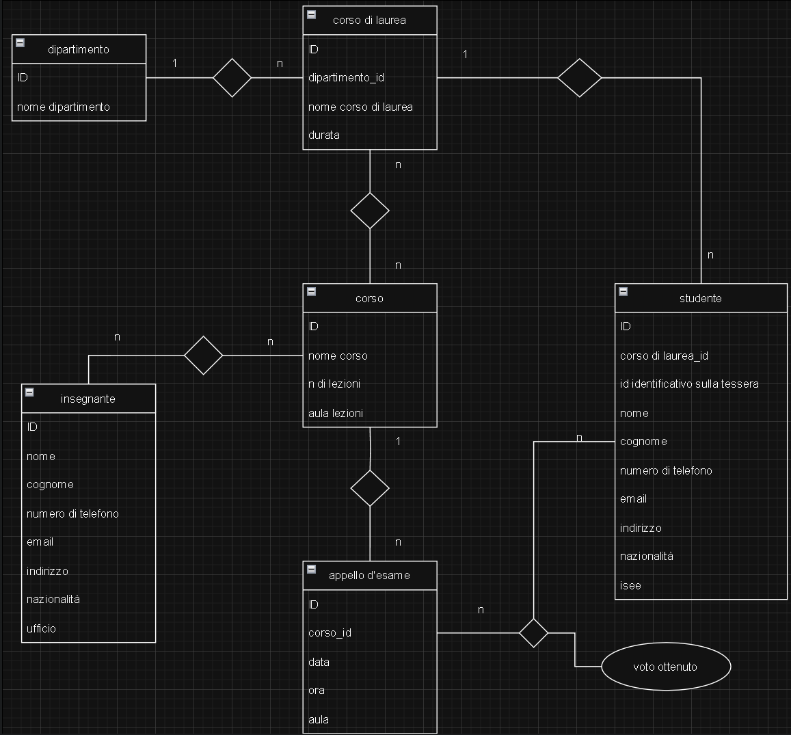

### spiegazione delle mie scelte  

- relazione dipartimento - corso di laurea:  
**uno a molti**: ogni dipartimento a diversi corsi di laurea  
---
- relazione corso di laurea - corso:  
**molti a molti**: ogni corso di laurea ha più corsi e ogni corso può far parte di più corsi di laurea 
---  
- relazione corso - appello:  
**uno a molti**: ogni corso ha più appelli  
---
- relazione insegnante - corso:  
**molti a molti**: ogni docente puù tenere più corsi, ogni corso può avere più insegnanti 
--- 
- relazione corso di laurea - studente:  
**uno a molti**: ogni corso di laurea ha più studenti, ma ogni studente può frequentare un corso di laurea a volta  
---
- relazione studente - appello d'esame:  
**molti a molti**: ogni studente può iscriversi a vari appelli e ogni per ogni appello possono esserci più studenti presenti.
In questa tabella ponte ho deciso di inserire anche la votazione che l alunno ottiene.  
---

